# 📝 Secure Blog Platform

A **3-Tier Architecture** web application built with modern DevOps practices.

> 🎯 **Purpose**: Teaching project for DevOps → DevSecOps pipeline using trending tools.

---

## 🏗️ Architecture

### Local Development (Docker Compose)
```
┌──────────────────────────────────────────────────────┐
│              TIER 1 — PRESENTATION                   │
│  Nginx (Docker) → serves frontend + proxies API      │
├──────────────────────────────────────────────────────┤
│              TIER 2 — APPLICATION                    │
│  Node.js + Express API (Docker)                       │
│  JWT Auth • Blog CRUD • Health Check                  │
├──────────────────────────────────────────────────────┤
│              TIER 3 — DATA                           │
│  PostgreSQL 15 (Docker)                               │
│  Users • Posts                                        │
└──────────────────────────────────────────────────────┘
```

### Production AWS Deployment (Multi-AZ)

```mermaid
graph TB
    subgraph Internet["🌐 Internet"]
        User["👤 Users"]
    end

    subgraph AWS["☁️ AWS Cloud"]
        subgraph Global["Global Services"]
            Route53["🌍 Route53<br/>DNS"]
            CloudFront["⚡ CloudFront<br/>CDN + Edge Cache"]
            WAF["🛡️ WAF<br/>Web Application Firewall"]
            ACM["🔐 ACM<br/>SSL/TLS Certificate"]
        end

        subgraph Region["us-east-1 Region"]
            subgraph VPC["VPC (10.0.0.0/16)"]
                
                subgraph AZ1["Availability Zone 1"]
                    subgraph PublicAZ1["Public Subnet (10.0.1.0/24)"]
                        ALB1["⚖️ ALB<br/>Target Group"]
                        NAT1["🔄 NAT Gateway"]
                    end
                    subgraph PrivateAZ1["Private Subnet (10.0.11.0/24)"]
                        ECS1["🐳 ECS Fargate Task<br/>Frontend + Backend"]
                    end
                    subgraph DataAZ1["Data Subnet (10.0.21.0/24)"]
                        RDS1["🗄️ RDS Primary<br/>PostgreSQL 15"]
                    end
                end

                subgraph AZ2["Availability Zone 2"]
                    subgraph PublicAZ2["Public Subnet (10.0.2.0/24)"]
                        ALB2["⚖️ ALB<br/>Target Group"]
                        NAT2["🔄 NAT Gateway"]
                    end
                    subgraph PrivateAZ2["Private Subnet (10.0.12.0/24)"]
                        ECS2["🐳 ECS Fargate Task<br/>Frontend + Backend"]
                    end
                    subgraph DataAZ2["Data Subnet (10.0.22.0/24)"]
                        RDS2["🗄️ RDS Standby<br/>PostgreSQL 15"]
                    end
                end

                IGW["🌐 Internet Gateway"]
                SG_ALB["🔒 Security Group: ALB<br/>Inbound: 80, 443"]
                SG_ECS["🔒 Security Group: ECS<br/>Inbound: 3000 (from ALB)"]
                SG_RDS["🔒 Security Group: RDS<br/>Inbound: 5432 (from ECS)"]
            end

            ECR["📦 ECR<br/>Container Registry"]
            SecretsManager["🔑 Secrets Manager<br/>DB Credentials"]
            CloudWatch["📊 CloudWatch<br/>Logs + Metrics"]
        end
    end

    User --> Route53
    Route53 --> CloudFront
    CloudFront --> WAF
    WAF --> ACM
    ACM --> IGW
    IGW --> ALB1
    IGW --> ALB2
    
    ALB1 --> ECS1
    ALB2 --> ECS2
    
    ECS1 --> RDS1
    ECS2 --> RDS1
    
    RDS1 -.Replication.-> RDS2
    
    ECS1 --> NAT1
    ECS2 --> NAT2
    NAT1 --> IGW
    NAT2 --> IGW
    
    ECS1 -.Pull Images.-> ECR
    ECS2 -.Pull Images.-> ECR
    
    ECS1 -.Get Secrets.-> SecretsManager
    ECS2 -.Get Secrets.-> SecretsManager
    
    ECS1 -.Send Logs.-> CloudWatch
    ECS2 -.Send Logs.-> CloudWatch
    ALB1 -.Send Logs.-> CloudWatch
    ALB2 -.Send Logs.-> CloudWatch

    style User fill:#4A90E2
    style Route53 fill:#FF9900
    style CloudFront fill:#FF9900
    style WAF fill:#DD344C
    style ACM fill:#DD344C
    style ALB1 fill:#FF9900
    style ALB2 fill:#FF9900
    style ECS1 fill:#FF9900
    style ECS2 fill:#FF9900
    style RDS1 fill:#3B48CC
    style RDS2 fill:#3B48CC
    style ECR fill:#FF9900
    style SecretsManager fill:#DD344C
    style CloudWatch fill:#FF9900
```



### Architecture Components

| Layer | Component | Purpose | High Availability |
|---|---|---|---|
| **DNS** | Route53 | Domain routing | ✅ Global service |
| **CDN** | CloudFront | Edge caching, DDoS protection | ✅ Global edge locations |
| **Security** | WAF | OWASP Top 10 protection | ✅ Integrated with CloudFront |
| **SSL/TLS** | ACM | Free HTTPS certificates | ✅ Auto-renewal |
| **Load Balancer** | ALB | Distribute traffic across AZs | ✅ Multi-AZ deployment |
| **Compute** | ECS Fargate | Serverless containers | ✅ Tasks in 2+ AZs |
| **Database** | RDS PostgreSQL | Managed database | ✅ Multi-AZ with auto-failover |
| **Networking** | VPC | Network isolation | ✅ Spans multiple AZs |
| **NAT** | NAT Gateway | Outbound internet for private subnets | ✅ One per AZ |
| **Registry** | ECR | Docker image storage | ✅ Regional service |
| **Secrets** | Secrets Manager | Encrypted credential storage | ✅ Regional service |
| **Monitoring** | CloudWatch | Logs, metrics, alarms | ✅ Regional service |


## 🚀 Quick Start (Local Development)

### Prerequisites
- Docker & Docker Compose installed

### Start Everything
```bash
# Clone the project
cd secure-blog-platform

# Start all 3 tiers
docker-compose up -d

# Check status
docker-compose ps

# View logs
docker-compose logs -f
```

### Access the App
| URL | Description |
|---|---|
| http://localhost | 📝 Blog Frontend |
| http://localhost/admin.html | 🔐 Admin Panel |
| http://localhost:3000/api/health | 💚 Health Check |
| http://localhost:3000/api/posts | 📜 Posts API |

### 🔌 Port Information

| Port | Service | Container | Purpose | Public Access |
|---|---|---|---|---|
| **80** | Nginx | `frontend` | HTTP web server (blog + admin UI) | ✅ Required |
| **3000** | Node.js | `backend` | Express API server | ⚠️ Optional (for direct API testing) |
| **5432** | PostgreSQL | `db` | Database server | ❌ Internal only |

**For EC2/Remote Deployment:**
- **Port 80** must be open in Security Group for web access
- Access via: `http://YOUR_EC2_PUBLIC_IP/`
- Admin panel: `http://YOUR_EC2_PUBLIC_IP/admin.html`
- Port 3000 can remain closed (frontend proxies API requests via Nginx)
- Port 5432 should **never** be exposed publicly (database is internal)

### First-Time Setup
1. Open http://localhost/admin.html
2. Click "Create Account"
3. Register as **admin** role
4. Login and create your first blog post
5. View it on http://localhost

### Stop Everything
```bash
docker-compose down       # Stop services
docker-compose down -v    # Stop + delete database data
```

---

## 📡 API Endpoints

### Auth
| Method | Endpoint | Auth | Description |
|---|---|---|---|
| POST | `/api/auth/register` | ❌ | Register new user |
| POST | `/api/auth/login` | ❌ | Login, get JWT token |
| GET | `/api/auth/me` | ✅ | Get current user profile |

### Posts
| Method | Endpoint | Auth | Description |
|---|---|---|---|
| GET | `/api/posts` | ❌ | List published posts |
| GET | `/api/posts/:id` | ❌ | Get single post |
| GET | `/api/posts/admin/all` | 🔑 Admin | List all posts (incl. drafts) |
| POST | `/api/posts` | 🔑 Admin | Create new post |
| PUT | `/api/posts/:id` | 🔑 Admin | Update post |
| DELETE | `/api/posts/:id` | 🔑 Admin | Delete post |

### Health
| Method | Endpoint | Description |
|---|---|---|
| GET | `/api/health` | Server + DB health status |

---

## 🛠️ Tech Stack

| Layer | Technology |
|---|---|
| Frontend | HTML, CSS, JavaScript, Nginx |
| Backend | Node.js, Express, Sequelize |
| Database | PostgreSQL 15 |
| Auth | JWT + bcrypt |
| Containers | Docker, Docker Compose |

---

## 📦 Project Structure

```
secure-blog-platform/
├── backend/                  # Tier 2 — Application
│   ├── src/
│   │   ├── config/           # Database config
│   │   ├── controllers/      # Auth + Post logic
│   │   ├── middleware/       # JWT auth, error handler
│   │   ├── models/           # Sequelize models
│   │   ├── routes/           # API routes
│   │   └── app.js            # Express entry point
│   ├── tests/                # Jest integration tests
│   ├── Dockerfile
│   └── package.json
├── frontend/                 # Tier 1 — Presentation
│   ├── css/                  # Stylesheets
│   ├── js/                   # Frontend JavaScript
│   ├── index.html            # Blog page
│   ├── admin.html            # Admin panel
│   ├── nginx.conf            # Nginx config
│   └── Dockerfile
├── terraform/                # Phase 2 — IaC
├── ansible/                  # Phase 3 — Config mgmt
├── .github/workflows/        # Phase 4 — CI/CD
├── monitoring/               # Phase 7 — Observability
├── docker-compose.yml        # Local 3-tier environment
└── README.md
```

---

## 🗺️ DevOps Roadmap

- [x] **Phase 1**: Application Code + Docker
- [ ] **Phase 2**: Terraform (VPC, ECS, RDS, ALB)
- [ ] **Phase 3**: Ansible (Config Management)
- [ ] **Phase 4**: CI/CD (GitHub Actions + Jenkins)
- [ ] **Phase 5**: AWS Security (Route53, CloudFront, WAF, ACM)
- [ ] **Phase 6**: DevSecOps (SonarQube, Trivy, Checkov)
- [ ] **Phase 7**: Monitoring (Prometheus, Grafana, CloudWatch)
- [ ] **Phase 8**: Advanced (EKS, ArgoCD, Helm)
